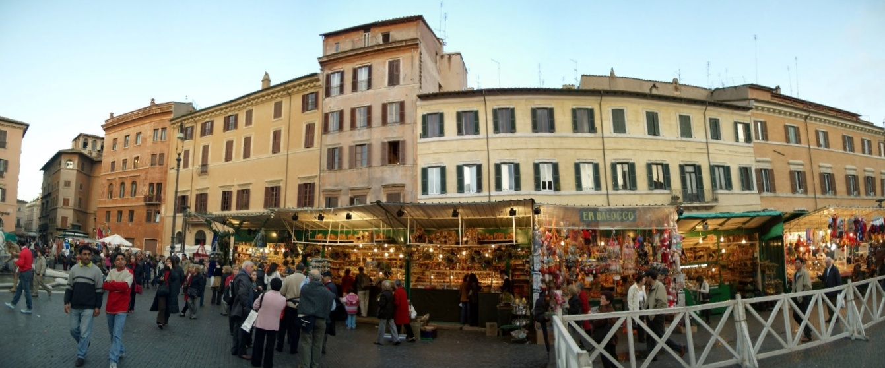
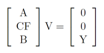

# Rectangling-Panoramic-Images-via-Warping
C++ implementation of the paper [Rectangling Panoramic Images via Warping](https://kaiminghe.github.io/publications/sig13pano.pdf), which can generating a rectangular panoramic image from the irregular one.

>Stitched panoramic images mostly have irregular boundaries. Artists and common users generally prefer rectangular boundaries, which can be obtained through cropping or image completion techniques. In this paper, we present a content-aware warping algorithm that generates rectangular images from stitched panoramic images. Our algorithm consists of two steps. The first local step is meshfree and preliminarily warps the image into a rectangle. With a grid mesh placed on this rectangle, the second global step optimizes the mesh to preserve shapes and straight lines. In various experiments we demonstrate that the results of our approach are often visually plausible, and the introduced distortion is often unnoticeable.

## Usage

Make sure you have following libraries:

- OpenCV
- OpenGL
- Eigen

and cmake.

Run following commands:

```
cd build
cmake ..
make
./Rectangling ../img/img3.jpg
```

Press "Enter" to save result image in the OpenGL window to "output" folder, you will see "opengl image saved" if success, or you can just press "Enter" again.

## Results



| Image Size | Time of Local Warping                 | Time of Global Warping | Time of Post-Process | Time in total |
| ---------- | ------------------------------------- | ---------------------- | -------------------- | ------------- |
| 636 x 359  | 721ms                                 | 862ms                  | 816ms                | 2400ms        |
| 640 x 291  | 619ms                                 | 1635ms                 | 1106ms               | 3361ms        |
| 1000 x 409 | 1474ms                                | 1961ms                 | 1339ms               | 4774ms        |
| 800 x 483  | 2477ms                                | 1821ms                 | 1859ms               | 6158ms        |
| 1157 x 698 | <span style="color:red">7755ms</span> | 1485ms                 | 2139ms               | 11380ms       |

Maybe my Local Warping part can be optimized by avoid using the `Mat.copyTo` function so many times, before and after calling the function.

## Notes

#### For the local warping part

To avoid the grid mesh covering missing pixels, I've used `erode` on the `mask` Mat.

I also used the `mask` Mat for preventing Seam Carving form getting the same seam.

I've tried **Improved Seam Carving**, but found it slower than seam carving. You can run line 170-213, line 361-404 instead of line 152-168, line 344-360 in `Seam.h` to test that. Or you can tell me if anything wrong in my implementation of Improved Seam Carving, for I implement it following my personal understand, because I didn't found how to use improved seam carving when we want to insert seams and enlarging the image.

#### For the global warping part

After get the grid mesh on the input image, the problem can be convert to a optimization of the following equations with fixed $\theta_{m}$.

$\displaystyle\min_{V}\{E = \displaystyle\|AV\|^2 + \lambda_{L} \|CFV\|^2 + \lambda_{B}\|BV-Y\|^2\}$, see [this article](https://iquilezles.org/articles/ibilinear/) for the calculation of $F$.

The least squares solution can be obtained by solving the following system of linear equations.



From a practical perspective, with $V$ fixed, $\theta_m$ can be obtained by calculating the average rotation angle of the line segments within a bin.

Note that it's important to set `  glPixelStorei(GL_UNPACK_ALIGNMENT, 1)` and `glPixelStorei(GL_PACK_ALIGNMENT, 1)`.

#### P.S.

For the project is almost done within 10 days, it's much far from perfect.

For example, I did not separate `Energy.h` to `Energy.h` and `Energy.cpp`, so as other files in the "include" folder, for leak of time.

qwq
